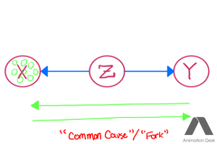

# Computer Science Communication

- Student Name: Simon Aayani
- Student #: 1001729999

## Sharing

Please indicate whether you are comfortable sharing your submissions. Include a short description whether you would like to tweet

- [x] Peers on Forum
- [ ] Anonymously via Course Twitter: [@ProbablyLearn](https://twitter.com/ProbablyLearn)
- [ ] My Personal Twitter: (which @ProbablyLearn can retweet!)
- [ ] Personal Blog: (which @ProbablyLearn can retweet!)
- [ ] Other:

## Introduction

The purpose of this post is to dive into the Bayes Ball Algorithm and to give a clear understanding of what it does, and how it works so we can apply it to our own models.

**So what exactly is the Bayes Ball Algorithm?** It's not just a funny play on Baseball but rather an algorithm for determining conditional independence of nodes in a Directed Acyclic Graph.

**How do you play Bayes-Ball?** Let X, Y, Z be the nodes in our DAG. There are 3 rules:

1. Shade all nodes that you are conditioning on (Z)
2. Place "balls" at each node whose conditional independence you want to figure out (X)
3. Play Bayesball! 
   * if at the end of the game there are balls in Y, then X and Y are conditionally dependent
   * otherwise, X and Y are conditionally independent

Okay, so I just said to play Bayes-Ball in one of the steps detailing how to play, which is a super annoying way of saying; follow the algorithm! I haven't really explained **how** to do that, so let's dive right in!

## Bayes Ball Algorithm

Our algorithm consists of 3 combinations/scenarios, in which the ordering of the nodes, as well as their edges, dictate their relationships with one another.

 These combinations are often represented as 3-node DAGs. For our examples we will name our nodes X, Y, and Z. The combinations we will consider are as follows:

### "Chain Pipe"

In "Chain Pipe" each node points to the next (X to Z to Y). Let's first look at how our balls flow from X to Y without conditioning (Don't pay attention to the green lines just yet! I will explain them once we introduce our conditioning.)

 As we can see in the GIF, without conditioning on any variable, we have a path from X through Z to Y where our balls can pass through freely. This means that there is a relationship between X and Y, they are dependent. Well what if we condition on a variable, say Z?

Our Bayes-Balls start in X and make their way down to Z, however notice that when the balls get to Z they try to push through to Y but they can't. In this scenario of Bayes-Ball, when we condition on Z we see that we are removing the relationship between X and Y. I.e. X and Y are conditionally independent ( $X \bot Y | Z$)! 

Well what are those green arrows at the bottom of the GIF? And what about Y, can we go the other way? Well Bayes-Balls don't actually have to follow the direction of the graph and can flow freely. What is being denoted by our arrows is the flow of the balls, and the vertical lines at the end of each arrow denotes no further movement. In our GIF we only show the flow of Balls from X towards Y, however the green arrows indicate that we can also go from Y towards X. If we would have placed our balls in Y instead of X we would get the same result, where the balls flow through to Z, but then "get stuck" and can't move any further. 

### "Common Cause" / "Fork"
Here, our graph is set up such that we have one parent node (Z), and two leaf nodes (X, Y). In our example we will be conditioning on Z, but what happens in our graph if we do not?

 

Just like above, without any conditioning; balls can flow freely from X to Y (and remember that they can go from Y to X as well!). How about when we condition on Z?

 

As with our "Chain Pipe", our balls get "stuck" when they reach Z. This once again applies regardless of the direction the balls are traveling (from X to Y, or Y to X), and just like in our "Chain Pipe" the result of conditioning on Z would make X and Y conditionally independent ( $X \bot Y | Z$)

### "Collider" / "Explain Away"

Lastly, we have our "Collider", which we achieve by orienting our nodes in such a way that there is only one leaf node and two parent nodes. 

Uh oh, they get stuck at Z! So what happens when we condition on our Z?

 

This is where things change! When you condition on Z for a "Collider", you are actually creating a dependence between X and Y. Intuatively, you can think of it as creating a pathway for your balls to go from X, through Z, and "up" to Y. We would say that $X \not\perp Y | Z$.

## Conclusion

So we have figured out how to play Bayes-Ball! The only quesion that remains is; Where is it used? Well unfortunately, this method is no longer very popular but it is still an incredibly intuative way to think about conditional independence. If you are interested in a deeper dive into this algorithm, I highly recommend reading  [this paper by Dr. Ross D Shachter!](https://arxiv.org/ftp/arxiv/papers/1301/1301.7412.pdf)

 So would you rather play Baseball or Bayes-Ball?

Drake gets it.

## Resources
Bayes-Ball Paper: https://arxiv.org/ftp/arxiv/papers/1301/1301.7412.pdf

Meme Generator: https://imgflip.com/memegenerator

Animation Desk: [Apple store download](https://apps.apple.com/ca/app/animation-desk-draw-animate/id946346179)

Looping my GIFs: https://ezgif.com/loop-count
